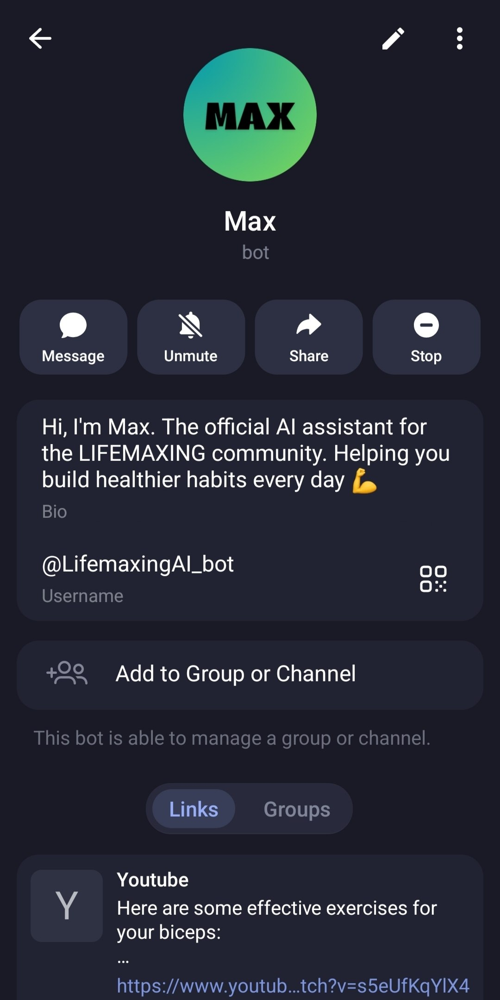
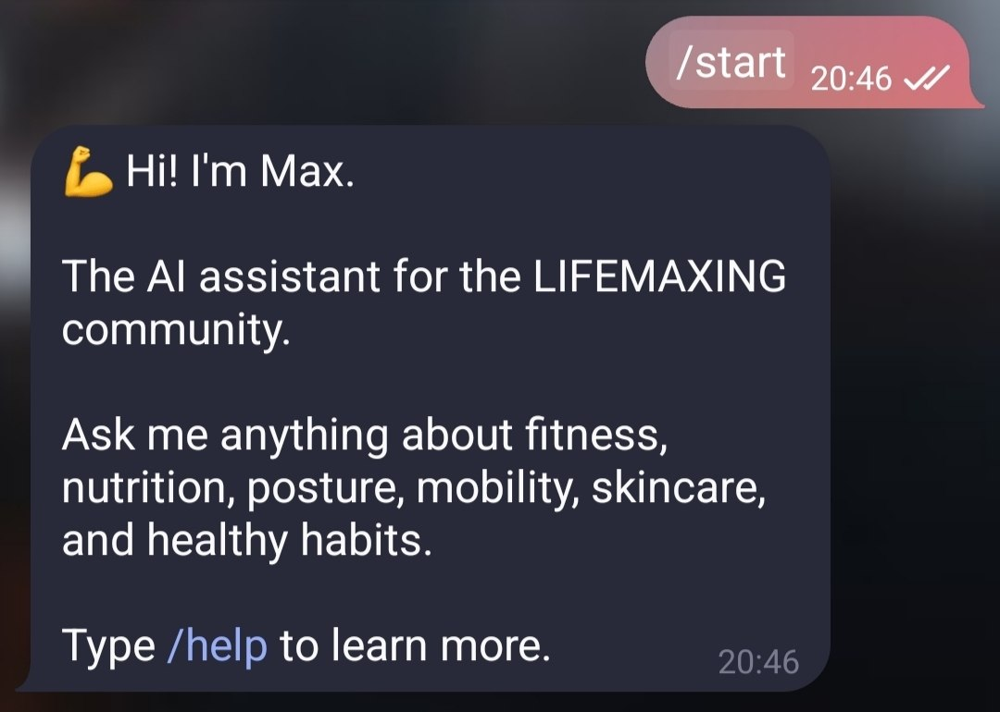
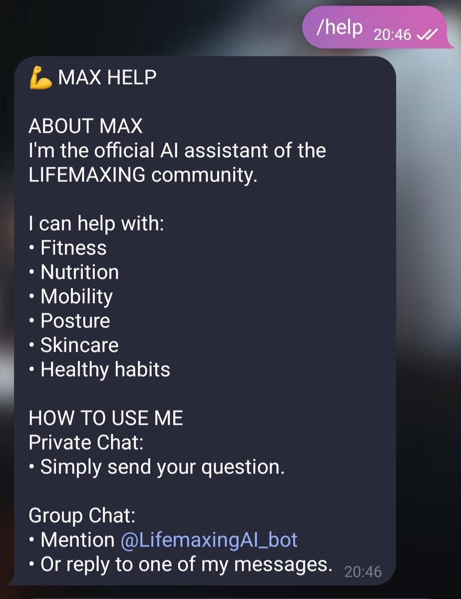
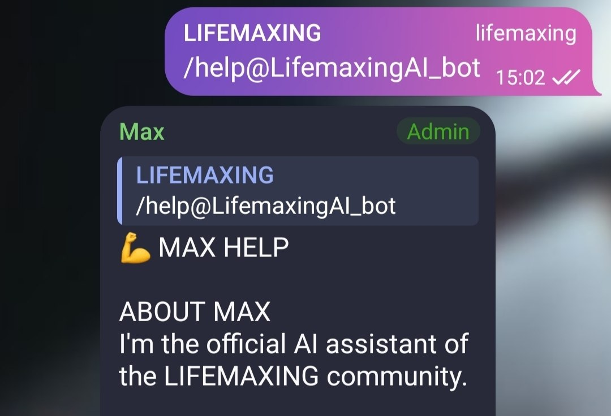
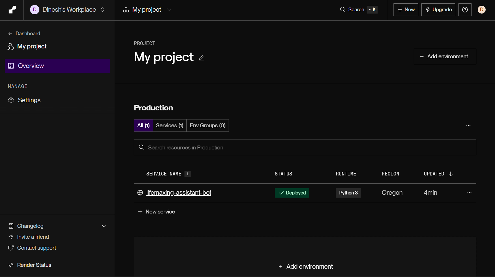

# 💪 LIFEMAXING Assistant Bot (Max)

Max is an AI-powered Telegram assistant built for the **LIFEMAXING** community. It provides evidence-based guidance on fitness, nutrition, mobility, posture, sleep, skincare, and healthy habits.

## 🚀 Features

- AI-powered health and fitness guidance
- Private chat support
- Telegram group support
- Mention and reply-to-bot detection
- Gemini 2.5 Flash with fallback model support
- Daily scheduled tips
- Rate limiting and bot protection
- Render cloud deployment
- Error handling and logging

---

# 📸 Screenshots

### Bot Profile

<p align="center">
  
</p>

---

### Commands

<p align="center">
  
  
</p>

---

### Private Chat & Group Interaction

<p align="center">
  
  
</p>

---

### Render Deployment

<p align="center">
  
</p>

---

# 🏗️ System Architecture

```text
User
 │
 ▼
Telegram
 │
 ▼
Max Bot (Python)
 │
 ├── Rate Limiter
 ├── Message Processing
 ├── Daily Scheduler
 └── Gemini API
         │
         ▼
      Response
```

---

# 🛠️ Tech Stack

| Component             | Technology          |
| --------------------- | ------------------- |
| Language              | Python              |
| Telegram Framework    | python-telegram-bot |
| AI Model              | Google Gemini       |
| Scheduler             | APScheduler         |
| Environment Variables | python-dotenv       |
| Hosting               | Render              |
| Version Control       | Git & GitHub        |

---

# 📂 Project Structure

```text
LIFEMAXING-Assistant-Bot-Max/
│
├── bot.py
├── requirements.txt
├── README.md
├── .gitignore
│
└── assets/
    └── images/
```

---

# ⚙️ Installation

```bash
git clone https://github.com/Dreamfyre23/LIFEMAXING-Assistant-Bot-Max.git
cd LIFEMAXING-Assistant-Bot-Max
pip install -r requirements.txt
```

---

# 🔑 Environment Variables

```env
TELEGRAM_BOT_TOKEN=YOUR_TELEGRAM_BOT_TOKEN
GEMINI_API_KEY=YOUR_GEMINI_API_KEY
```

---

# ▶️ Running Locally

```bash
python bot.py
```

---

# 🚀 Deploying on Render

Build Command:

```bash
pip install -r requirements.txt
```

Start Command:

```bash
python bot.py
```

Environment Variables:

- TELEGRAM_BOT_TOKEN
- GEMINI_API_KEY

---

# 📋 Commands

| Command  | Description           |
| -------- | --------------------- |
| /start   | Start the bot         |
| /help    | Show help information |
| /testtip | Generate today's tip  |
